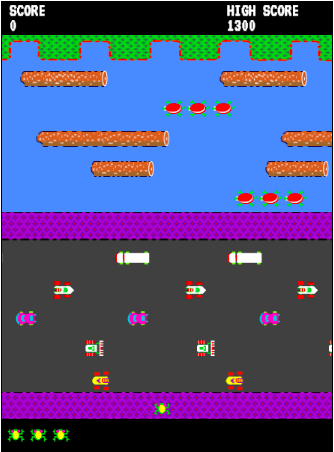

# Game Time!

## Purpose

Last week we completed our first group project! We were split into duos and given two options of things to work on. First, we could build a clone of some g suite application like google calendar. Or, we could build an old school arcade game. All the groups chose the game. Myself and fellow bootcamp attendee Ryan Borja decided to take a shot at building Frogger.


<sub>*If you don't know what frogger is, I'll let you google that on your own time.*</sub>

This was an exercise in professional communication and collaboration. We were encouraged to only use digital means, like Slack and GitHub issues, to converse with teammates as well as heavily documenting our code. It turns out we needed the practice. We'll take a look at the code first and come back to communication in a minute.

## The Code

We utilized a feature of HTML that we had not previously encountered called canvas. The `<canvas>` tag is an HTML element that allows developers to draw and manipulate visuals on the fly with scripts (usually JavaScript). This is surprisingly powerful. Take a look at the body of our HTML file and our entire CSS file:

##### HTML
```
<body>
     <div id="game-div">
       <canvas id="game" width="440px" height="600"></canvas>
       <div id="controls">
         <button id="newGameBtn">NEW GAME?</button>
         <p id="pressSpaceToContinue">PRESS SPACE TO CONTINUE</p>
       </div>
     </div>
     
     
     


       <script src="main.js"></script>
   </body>
   ```

##### CSS
```
body {
    font-family: 'VT323', monospace;
}

#game {
    border: 1px solid black;
}

#game-div {
    margin-top: 30px;
    text-align: center;
    position: relative;
    z-index: 1;
}

#pressSpaceToContinue{
  color: red;
  background: black;
  font-size: 30px
  left: 30%;
}


#controls{
  text-align: center;
  position: absolute;
  z-index: 2;
  top: 92%;
  left: 45%;
}

button{
  font-family: 'VT323', monospace;
  font-size: 30px;
  color: red;
  background-color: black;
  height: 45px;
  width: 135px;
  display: inline-block;
  border-style: none;
}

button:focus{
  outline: 0;
}

img {
    display: none;
}
```

Not much there, right? Using that canvas element we created a game that looks like this:



This took <strong>a lot</strong> of JavaScript but you can see the utility of canvas. I'll post a link to the entire project below.

## Communication

Communication skills are valued in any role at any company anywhere. There's not a job in existence where you'll never have to pass information to others. You can't learn it on your own. That is why the bootcamp experience can be so valuable. Having experience using professional tools to communicate is a huge opportunity that you can't have if you're self-taught.
