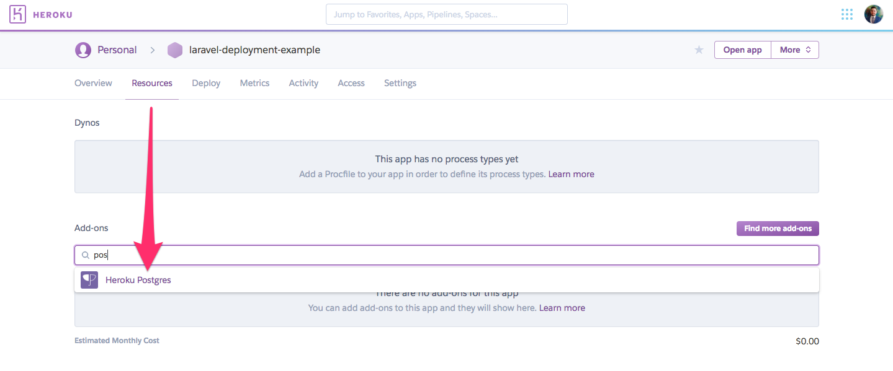
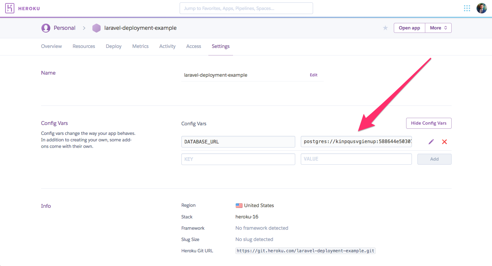
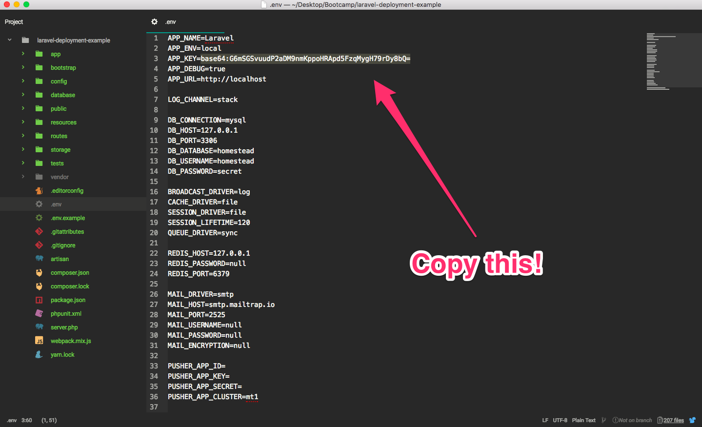
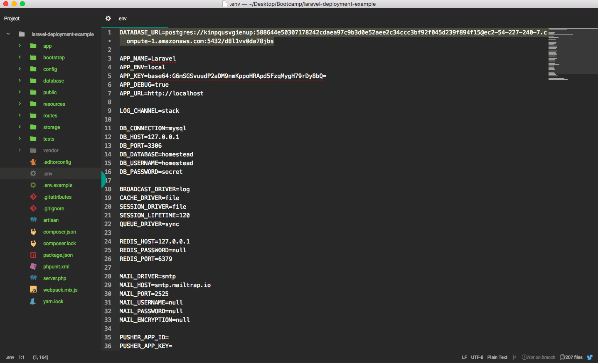
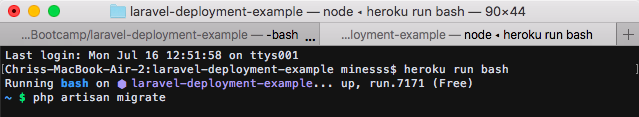

## Purpose

Laravel is a very popular and complex PHP framework that provides a multitude of utilites in order to simplify code and optimize production speed. Heroku is a powerful platform for building, managing, and deploying web applications which is also quite popular in its own right. PostgreSQL is a powerful, open source object-relational database system with over 30 years of active development that has earned it a strong reputation for reliability, feature robustness, and performance.<sup>1</sup> Therefor, pushing your Laravel application to Heroku and implementing a PostgreSQL database should be easy, not hard. Let's make it easy.

## Deployment

I'm going to guide you through several steps starting with the preparation of the platform and obtaining the proper credentials. Then I'll instruct you on how to prepare the Laravel application for upload. We'll use data obtained from Heroku to access our database before finally bringing everything together for deployment.

> Warning: This walkthrough assumes basic knowledge about Laravel, Heroku, and PostgreSQL. If you are a beginner seeing these things for the first time, these aren't the droids you're looking for.

### Preparing Heroku

Create a new app on Heroku and set up your Heroku remote repository as you would for any other project but **do not push your project to Heroku yet.**

Next, navigate to the *Resources* tab. You will see a section for "Add-ons" with a search bar. If you start to type 'postgres' the official "Heroku Postgres" add-on will appear. Click it and a modal will appear where you can select your plan name (I'm guessing we're sticking with the free "Hobby Dev" option for now), and click *Provision*.

Resources Page             |  Add-on Modal
:-------------------------:|:-------------------------:
  |  

Next, navigate to the settings tab and locate the *Config Vars* section and select *Reveal Config Vars*. When you reveal them you will see a configuration variable already with a key of `DATABASE_URL`. This is only created **after** we add the postgres add-on. If you look for it before provisioning the add-on **it will not be there**.



We still need to populate two more config variables in order for our project to make all the required connections correctly. The first one is to make a key called `DB_CONNECTION` with a value of `pgsql`. The other one will be the `APP_KEY`. It's possible to create a new `APP_KEY` but you already have one. In your Laravel project open your `.env` file. The required value should be the third variable down. Copy and past that value into your cofig var on Heroku.



### Change Laravel Configurations

Heroku is now ready for our project but our project isn't yet ready for Heroku.

In order to have our application using the Heroku database we just made, we need to utilize the `DATABASE_URL` we saw earlier. Copy the value from that field and paste it into your `.env` file with the variable assignment like so:



> NOTE: Make sure there are no spaces between DATABASE_URL, =, and the actual URL. They need to all be on one line with no spaces or Laravel might not read the file correctly.

Next, we need to change some variables in the `database.php` file within the config directory. First, paste the statement below into the top of your code, but still within the php tag.

``` php
$DATABASE_URL = parse_url(getenv("DATABASE_URL"));
```

Then, scroll down to the `pgsql` section and change the variables to look like this:

``` php
'pgsql' => [
    'driver' => 'pgsql',
    'host' => $DATABASE_URL['host'],
    'port' => $DATABASE_URL["port"],
    'database' => ltrim($DATABASE_URL["path"], "/"),
    'username' => $DATABASE_URL["user"],
    'password' => $DATABASE_URL["pass"],
    'charset' => 'utf8',
    'prefix' => '',
    'schema' => 'public',
    'sslmode' => 'prefer',
],
```

That's it! You can now push your project to Heroku and have it successfully interface with your PostgreSQL database on Heroku's server.

### Connecting to your Heroku Database

Now that we have our project configured correctly we would probably like to view our database. I use PSequel on Mac to view my databases but you can use whatever product you wish. PSequel makes this connection very easy. Simply copy the `DATABASE_URL` that we've seen a few times now, then open PSequel and click "Import from URL in Clipboard". PSequel will handle the rest for you. Also, make sure you check the `SSL` box. Heroku requires SSL is used but you don't have to populate and of the fields.


### Don't Forget to Migrate

Finally, before we can start saving user credentials or anything else we have to make sure we have our tables set up in our database! Using the Heroku CLI execute `heroku run bash` to start a Heroku bash prompt. Then, execute the usual `php artisan migrate` command to migrate your tables. It's that easy!



## Wrap-Up

We're all set! I hope this walkthrough was succinct and easy to digest. Contact me with any questions or comments!
